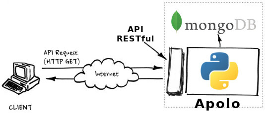
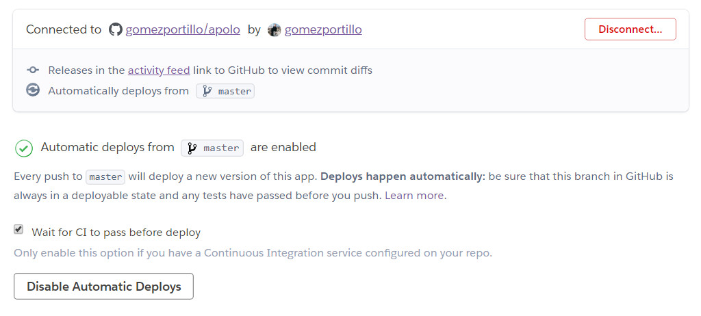

# Proyecto de Cloud Computing

* [Página web del proyecto](https://gomezportillo.github.io/apolo/).

## Tabla de contenidos

<!-- TOC depthFrom:1 depthTo:6 withLinks:1 updateOnSave:1 orderedList:0 -->

- [Build status](#build-status)
- [Descripción del problema](#descripcin-del-problema)
- [Solución propuesta](#solucin-propuesta)
- [Definición del proyecto](#definicin-del-proyecto)
- [Arquitectura](#arquitectura)
	- [Comunicación de microservicios](#comunicacin-de-microservicios)
- [Planificación](#planificacin)
- [Despliegue](#despliegue)
	- [Testing en Travis-CI](#testing-en-travis-ci)
	- [Despliegue en Heroku](#despliegue-en-heroku)
- [Provisionamiento](#provisionamiento)
	- [Ansible](#ansible)
	- [Testing de Ansible](#testing-de-ansible)
- [Autmatización de creación de VM con el CLI de Azure](#autmatización-de-creación-de-vm-con-el-cli-de-azure)
- [Orquestación con Vagrant](#orquestación-con-vagrant)
- [Funcionalidad implementada](#funcionalidad-implementada)
	- [Ejemplo de ejecución práctico](#ejemplo-de-ejecucin-prctico)
- [URLs de desgliegue](#urls-de-desgliegue)
	- [Hito 2 (Heroku)](#hito-2-heroku)
	- [Hito 3 (Azure)](#hito-3-azure)
	- [Hito 4 (Acopio)](#hito-4-acopio)
	- [Hito 5 (Vagrant)](#hito-5-vagrant)

<!-- /TOC -->

# Build status

[](https://travis-ci.org/gomezportillo/apolo)

Para más información acerca de los tests ir a la sección [Testing en Travis-CI](#testing-en-travis-ci).

# Descripción del problema

Hoy en día cada vez es más común que las personas aprendan a tocar instrumentos y ensayen en bandas, pero es difícil encontrar personas con tu misma educación musical y gustos con los que poder quedar para ensayar.

# Solución propuesta

**Apolo** nace como una plataforma para poner en contacto a personas que busquen compañeros con intereses similares para compartir su afición a la música.

# Definición del proyecto

Este proyecto es el back-end un servicio que almacenará los datos de sus usuarios, como los instrumento que tocan, su nivel de educación musical, sus intereses musicales y la distancia que están dispuestos a recorrer para quedar con gente.

Para conseguir enviar información, **Apolo** implementará una [API REST](https://bbvaopen4u.com/es/actualidad/api-rest-que-es-y-cuales-son-sus-ventajas-en-el-desarrollo-de-proyectos) propia, es decir, una API que utiliza verbos HTTP para comunicar al cliente y al servidor.



Esta API REST trabajará sobre una base de datos no relacional [MongoDB](https://www.mongodb.com/es) que estará almacenada en el servicio de DBaaS [mLab](https://mlab.com).

# Arquitectura

**Apolo** está desarrollado en [Python3](https://www.python.org/) y el objetivo es que utilice una arquitectura basada en microservicios para facilitar su escalabilidad y aumentar su mantenibilidad.

* Un microservicio para registrar nuevos usuarios.
* Un microservicio para encontrar usuarios en la base de datos.
* Un microservicio para actualizar la información de los usuarios.
* Un microservicio para borrar a sus usuarios del sistema.

## Comunicación de microservicios

Lo principal en una arquitectura de microservicios es que se trata de unidades que se van a desplegar de forma independiente; diferentes servicios que trabajarán de forma totalmente independiente unos de otros.

Tras esta definición es fácil ver que surge la necesidad de comunicar unos microservicios con otros. Para conseguirlo se hará uso de un broker o cola de mensajería. Concretamente se usará [pika](https://pypi.org/project/pika/), la implementación en Python de [RabbitMQ](https://www.rabbitmq.com/).

# Planificación

Cada hito tiene un link a su página en GitHub.

* [x] [Hito 0](https://github.com/gomezportillo/apolo/milestone/4): Crear el repositorio del proyecto y hacer fork del repositorio de la asignatura.
* [x] [Hito 1](https://github.com/gomezportillo/apolo/milestone/1): Crear página web con la definición de la arquitectura.
* [x] [Hito 2](https://github.com/gomezportillo/apolo/milestone/2): Crear un microservicio y desplegarlo en Travis y Heroku automáticamente tras pasar los tests.
* [x] [Hito 3](https://github.com/gomezportillo/apolo/milestone/3): Provisionamiento con Ansible
* [x] [Hito 4](https://github.com/gomezportillo/apolo/milestone/5): Automatización de creación de VM con el CLI de Azure
* [x] [Hito 5](https://github.com/gomezportillo/apolo/milestone/6): Orquestación con Vagrant
* [ ] [Hito 6](https://github.com/gomezportillo/apolo/milestone/6): Contenedores Docker

# Despliegue

Para conseguir el efecto **Gran botón rojo** del que hablamos en teoría (poder desplegar totalmente una aplicación al darle a un solo botón) he creado un pipeline de trabajo en el que tras hacer un push a la rama master, el proyecto es testeado en Travis-CI de donde, solo tras pasar los test, es desplegado automáticamente en Heroku.


Para conseguir la integración con Travis-CI y Heroku, tras añadir el proyecto en ambos sitios, fue necesario generar en el archivo de configuración de Travis-CI un token de autenficaición de Heroku encriptado con Travis-CI con el comando `travis encrypt $(heroku auth:token) --add deploy.api_key`, y tras esto activar dicha opción en la página de Heroku.



## Testing en Travis-CI

El archivo de configuración de Travis-CI puede verse [aquí](.travis.yml) y los tests,

* Del DAO del usuario, [aquí](apolo/test/test_daouser.py).
* Del servidor, [aquí](apolo/test/test_server.py).

Dicho archivo de configuración contiene la rama que será testeada, el lenguaje de programación y su versión, las dependencias del proyecto (guardadas en el archivo [requirements.txt](requirements.txt)), la ruta hacia los tests a ejecutar y la información necesaria para desplegar la aplicación en Heroku una vez pasados los tests.

## Despliegue en Heroku

Heroku ha sido elegido como el PaaS a usar principalmente por ofrecer un amplio servicio así como su documentación de manera gratuita.

Para configurarlo han sido necesarios varios archivos,

* [Procfile](Procfile). En este archivo se especifica el tipo de dyons así como el comando que necesita Heroku para desplegar el proyecto.
* [runtime.txt](runtime.txt). En este archivo se especifica la versión del lenguaje de programación que usa el proyecto.
* [requirements.txt](requirements.txt). Este archivo es compartido con Travis-CI y especifica las dependencias del proyecto. Ambos sitios las instalan ejecutando `pip install -r requirements.txt`.

Por otro lado, aunque se recomienda la utilización de un WSGI (Web Server Gateway Interface) como `gunicorn` (o `waitress` en Windows) por sus diversas ventajas y un proxy de buffering reverso como `Nginx` a la hora de desplegar el servidor, para un proyecto tan pequeño de momento se ha considerado que no es necesario, aunque en un futuro esto pueda cambiar.

# Provisionamiento

## Ansible

[Ansible](https://www.ansible.com/) es un sistema que permite el provisionamiento de máquinas remotas fácilmente. La imagen inferior muestra un croquis de cómo funciona.


Para ello, se ha configurado en Azure una máquina Ubuntu Server 18.04 LTS en Azure para acceder a ella a través de SSH, subiendo la clave pública y guardando la privada en local, y tras obtener su IP se ha ejecutado Ansible para que instale en ella todos los componentes necesarios.

Una documentación más extensa y detallada de este hito puede verse [en el siguiente enlace](provision/).

## Testing de Ansible

Yo he probado el proyecto de [@fpeiro](https://github.com/fpeiro) y este proyecto ha sido probado por [@xenahort](https://github.com/xenahort). En el [README de Ansible](provision/) se incluye más detalles, así como los pantallazos generados tras su ejecución.

# Autmatización de creación de VM con el CLI de Azure

La documentación del **hito 4** referente a la automatización de la creación de máquinas virtuales con el cliente de línea de comandos de Azure puede verse en el [siguiente enlace](acopio/README.md).

# Orquestación con Vagrant

La documentación del **hito 5** correspondiente a la orquestación de máquinas virtuales con Vagrant puede verse [en el siguiente enlace](orquestacion/README.md).

# Funcionalidad implementada

Actualmente **Apolo** atiende las siguientes peticiones HTTP con los parámetros `{'email': $CORREO, 'instrument': $INSTRUMENTO}` y devuelve las respuestas en formato JSON. Además, ofrece un manejo de las excepciones `404` y `405` de HTTP e indica a través de códigos HTTP el resultado de las operaciones.

* **PUT** en `/rest/users` guarda en la base de datos el usuario especificado en los parámetros.
* **POST** en `/rest/users` actualiza el usuario indicado en los parámetros.
* **GET** en `/rest/users/<email>` devuelve el usuario con el email indicado.
* **DELETE** en `/rest/users/<email>` borra el usuario con el email indicado.
* **GET** en `/rest/users/all` devuelve todos los usuario del sistema.
* **DELETE** en `/rest/users/all` elimina todos los usuarios del sistema.
* **GET** en `/rest/log` devolverá el log completo del servidor, que incluye la fecha de despliegue, los errores y las órdenes de creación y borrado de usuarios, así como los errores que haya habido.

Esto puede verse con más profundidad en el [propio servidor](apolo/server.py).

## Ejemplo de ejecución práctico

La orden HTTP,

```
PUT/ {'email':'jhon@doe', 'insturment', 'guitar'} en https://apolo-cc.herokuapp.com/rest/users
```

Devolverá la cadena JSON,

```
{'status': 'SUCCESS', 'message': 'On inserting usser with email jhon@doe'}
```

Siempre y cuando dicho email no exista previamente, ya que es la clave primaria o _index_ en MongoDB. En ese caso devolvería,

```
{'status': 'EMAIL_ALREADY_EXISTS', 'message': 'On inserting usser with email jhon@doe'}
```
# URLs de desgliegue

## Hito 2 (Heroku)

Despliegue: https://apolo-cc.herokuapp.com/

## Hito 3 (Azure)

MV: 23.96.18.95

## Hito 4 (Acopio)

MV2: 13.79.23.106

## Hito 5 (Vagrant)

Despliegue Vagrant: 40.127.169.118
