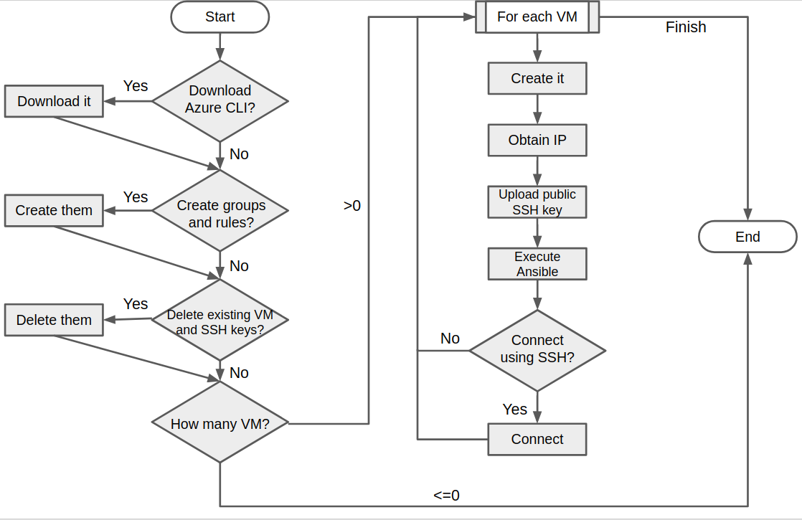
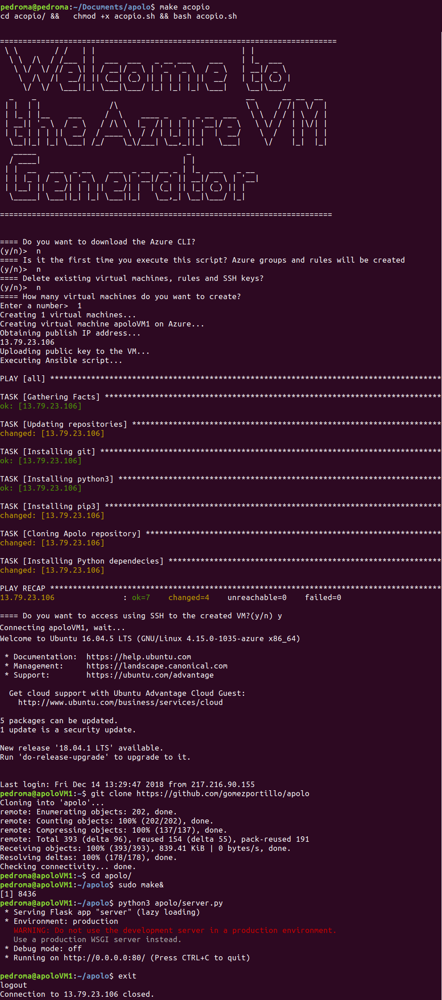

# Documentación del hito 4

<!-- TOC depthFrom:1 depthTo:6 withLinks:1 updateOnSave:1 orderedList:0 -->

- [Documentación del hito 4](#documentacin-del-hito-4)
	- [Instalación de el CLI de Azure](#instalacin-de-el-cli-de-azure)
	- [Listado de todas las imágenes de máquinas virtuales disponibles](#listado-de-todas-las-imgenes-de-mquinas-virtuales-disponibles)
		- [Opción 1. Sólo con la API de Azure](#opcin-1-slo-con-la-api-de-azure)
		- [Opción 2. Usando `jq` para filtrar las imágenes](#opcin-2-usando-jq-para-filtrar-las-imgenes)
	- [Pruebas de velocidad entre los distintos centros de datos de Azure](#pruebas-de-velocidad-entre-los-distintos-centros-de-datos-de-azure)
	- [Selección de la imagen a utilizar](#seleccin-de-la-imagen-a-utilizar)
	- [Script de automatización de creación de máquinas virtuales](#script-de-automatizacin-de-creacin-de-mquinas-virtuales)
		- [Ejecución del script](#ejecucin-del-script)
		- [Diagrama de flujo](#diagrama-de-flujo)
		- [Salida del script](#salida-del-script)

<!-- /TOC -->

## Instalación de el CLI de Azure

Para instalar el cliente de línea de comandos de Azure se han ejecutado los siguientes comandos en local, de acuerdo con la [guía oficial de Microsoft](https://docs.microsoft.com/es-es/cli/azure/install-azure-cli-apt?view=azure-cli-latest).

* Para añadir Azure a la lista de repositorios

```bash
sudo apt-get install apt-transport-https lsb-release software-properties-common -y
AZ_REPO=$(lsb_release -cs)
```

* Para añadir las claves de firma de Microsoft

```bash
echo "deb [arch=amd64] https://packages.microsoft.com/repos/azure-cli/ $AZ_REPO main" | sudo tee /etc/apt/sources.list.d/azure-cli.list
sudo apt-key --keyring /etc/apt/trusted.gpg.d/Microsoft.gpg adv --keyserver packages.microsoft.com --recv-keys BC528686B50D79E339D3721CEB3E94ADBE1229CF
```

* Para actualizar la lista de repositorios e instalar Azure

```bash
sudo apt-get update
sudo apt-get install azure-cli
```

* Para iniciar sesión en el CLI de Azure

```bash
az login
```

Lo que devolverá un mensaje JSON parecido al siguiente.


## Listado de todas las imágenes de máquinas virtuales disponibles

### Opción 1. Sólo con la API de Azure

```bash
az vm image list --output table --all
```

Más información en la [documentación de Microsoft](https://docs.microsoft.com/es-es/azure/virtual-machines/linux/cli-ps-findimage).

### Opción 2. Usando `jq` para filtrar las imágenes

`jq` es una librería para trabajar con mensajes JSON. A través de su uso podemos filtrar la lista obtenida de la API de Azure y adaptarla para verla mejor. Un ejemplo de su uso sería el siguiente.

```bash
az vm image list --offer Ubuntu --all | jq ".[] | [.offer, .publisher, .sku]"
```

Un fragmento de la salida de la ejecución del comando anterior es la siguiente.

```json
[
  "secure-ubuntu-os",
  "atomicorp",
  "asl-1-0002"
]
[
  "azul-zulu-ubuntu-1804",
  "azul",
  "azul-zulu-ubtu1804"
]
[
  "cis-ubuntu-linux-1404-v2-0-0-l1",
  "center-for-internet-security-inc",
  "cis-ubuntu1404-l1"
]
...
```

Su ejecución puede durar bastante, por lo que se ha añadido la salida ejecutada el día 13/12/2018 en el archivo [jq-output.txt](jq-output.txt).

De este modo es mucho más fácil encontrar el publisher y la versión específica que necesitamos.

## Pruebas de velocidad entre los distintos centros de datos de Azure

Inicialmente se tuvo la necesidad de decidir la localización geográfica del servidor de Azure en el que se va a desplegar el proyecto. Como no se contaban con datos empíricos para tomar dicha decisión, se ha decidido usar la herramienta de código abierto `httperf` para obtener datos que ayuden a tomar esta decisión, ya que permite medir el tiempo de conexión y respuesta de servidores.

Por cercanía a la zona de la que van a ser la mayoría de los usuarios de este proyecto (España), se ha elegido entre las localizaciones *North Europe* y *West Europe*. Tras crear dos máquinas con Ubuntu Server 18.04 LTS idénticas, una en cada localización, y ejecutar la orden

`httperf --port 80 --num-conns 10 --rate 1 --server $(IP)`,

se han recopilado los resultados obtenidos en la siguiente tabla. El argumento `--num-conns` indica el número de conexiones realizadas, en este caso 10, por lo que en cada localización se trabajará con la media de estas 10 conexiones.

| Característica | North Europe | West Europe   |
| -------------- |-------------:| -------------:|
| Connection rate (ms/conn)     | 911.6 |	985.4 |
| Connection time(ms) 			    | 184.1 | 225.1 |
| Reply time in response (ms)   |  77.2 |  92.7 |
| Reply time in transfer (ms)   |  1.5  |  5.9  |

A la vista de estos resultados (cuanto menor, mejor) se ha elegido **North Europe** como localización para las máquinas virtuales.

## Selección de la imagen a utilizar

A la vista de los resultados del [siguiente artículo](https://www.premper.com/por-que-usamos-servidores-ubuntu), y siendo un sistema que ya conocía, he elegido usar **Ubuntu Server 18.04 LTS** o, por su nombre en clave, **Bionic Beaver**, como sistema operativo en el que se desplegará el proyecto. Es importante que sea una LTS ya que necesitamos soporto a largo plazo.

Por otro lado, al ser una de las distribuciones más famosas de Linux, es muy probable que todos los programas y librerías que vaya a necesitan den soporte a esta distribución.

## Script de automatización de creación de máquinas virtuales

En el archivo [acopio.sh](acopio.sh) puede verse el resultado de este hito. En esencia, este script pregunta al usuario por los siguientes parámetros,

* ¿Instalar el CLI de Azure?
* ¿Crear grupo de recursos y de seguridad de red?

Si sí se ejecutará

```console
az group create --location $LOCATION --name $RES_GROUP
az network nsg create --resource-group $RES_GROUP --name $NS_GROUP  >/dev/null
az network nsg rule create --resource-group $RES_GROUP --nsg-name $NS_GROUP --name SSH_rule --protocol tcp --priority 320 --destination-port-range 22 --access allow
az network nsg rule create --resource-group $RES_GROUP --nsg-name $NS_GROUP --name HTTP_rule --protocol tcp --priority 300 --destination-port-range 80 --access allow
```

* ¿Borrar máquinas virtuales y claves SSH creadas anteriormente?

Si sí se ejecutará

```bash
az vm delete --ids $(az vm list --resource-group $RES_GROUP --query "[].id" -o tsv) --yes >/dev/null
az network nsg delete --resource-group $RES_GROUP -n $NS_GROUP
ssh-keygen -t rsa -b 2048 -f $SSH_KEY_LOCATOIN -q -N "" -y
```

* ¿Cuántas máquinas virtuales crear?

Por cada una de ellas se ejecutará

```bash
az_output=$(az vm create --resource-group $RES_GROUP --name $VM_NAME --nsg $NS_GROUP --image UbuntuLTS --size Standard_B1s)
IP=$(echo $az_output | jq -r '.publicIpAddress')
az vm user update --resource-group $RES_GROUP --name $VM_NAME --user $VM_USER --ssh-key-value "$(cat $SSH_KEY_LOCATOIN.pub)"
ansible-playbook --inventory "$IP," --user $VM_USER playbook.yml
```

* Y, tras crear cada una, ¿conectar a través de SSH?

Si sí se ejecutará

```bash
ssh -i $SSH_KEY_LOCATOIN $VM_USER@$IP
```

### Ejecución del script

Como es un script Bash, y [Bash y Shell no son lo mismo](https://askubuntu.com/questions/172481/is-bash-scripting-the-same-as-shell-scripting), se necesita el comando `bash` para ejecutarlo. Para hacerlo por primera vez, basta con situarse en el directorio _acopio/_ y ejecutar `chmod +x acopio.sh` para conceder permisos de ejecución al archivo y ejecutarlo con `bash acopio.sh`.

Se ha añadido al `Makefile` del proyecto la orden `acopio` para ejecutar automáticamente estas órdenes. Para ello, basta con situarse en el directorio raiz dep proyecto y ejecutar `make acopio`.

### Diagrama de flujo

El diagrama de flujo de la ejecución de este script es el siguiente.



### Salida del script

A continuación de muestra una imagen de la ejecución del script tras indicarle que no queremos instalar el CLI de Azure, no queremos crear nuevos grupos ni no queremos borrar los que ya existen y queremos crear una máquina virtual.



La máquina que se ha utilizado para pasar los test de este hito ha sido esta misma, con IP `13.79.23.106
`, y no se ha accedido al portal de Azure para cambiarla en absolutamente nada.
