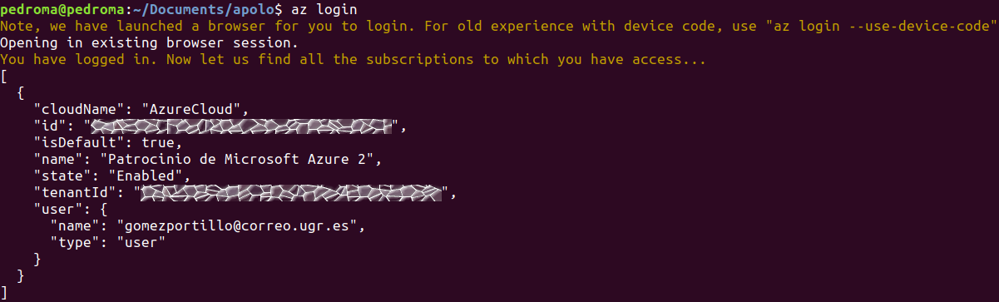

# Documentación del hito 4

<!-- TOC depthFrom:1 depthTo:6 withLinks:1 updateOnSave:1 orderedList:0 -->

- [Documentación del hito 4](#documentacin-del-hito-4)
	- [Instalación de el CLI de Azure](#instalacin-de-el-cli-de-azure)
	- [Listado de todas las imágenes de máquinas virtuales disponibles](#listado-de-todas-las-imgenes-de-mquinas-virtuales-disponibles)
	- [Opción 1. Sólo con la API de Azure](#opcin-1-slo-con-la-api-de-azure)
	- [Opción 2. Usando `jq` para filtrar las imágenes](#opcin-2-usando-jq-para-filtrar-las-imgenes)
	- [Selección de la imagen a utilizar](#seleccin-de-la-imagen-a-utilizar)
	- [Pruebas de velocidad entre los distintos centros de datos de Azure](#pruebas-de-velocidad-entre-los-distintos-centros-de-datos-de-azure)
	- [Script de automatización de creación de VM](#script-de-automatizacin-de-creacin-de-vm)
		- [Ejecución del script](#ejecucin-del-script)

<!-- /TOC -->

## Instalación de el CLI de Azure

Para instalar el cliente de línea de comandos de Azure se han ejecutado los siguientes comandos en local, de acuerdo con la [guía oficial de Microsoft](https://docs.microsoft.com/es-es/cli/azure/install-azure-cli-apt?view=azure-cli-latest).

* Para añadir Azure a la lista de repositorios

```bash
sudo apt-get install apt-transport-https lsb-release software-properties-common -y
AZ_REPO=$(lsb_release -cs)
```

* Para añadir las claves de firma de Microsoft

```bash
echo "deb [arch=amd64] https://packages.microsoft.com/repos/azure-cli/ $AZ_REPO main" | sudo tee /etc/apt/sources.list.d/azure-cli.list
sudo apt-key --keyring /etc/apt/trusted.gpg.d/Microsoft.gpg adv --keyserver packages.microsoft.com --recv-keys BC528686B50D79E339D3721CEB3E94ADBE1229CF
```

* Para actualizar la lista de repositorios e instalar Azure

```bash
sudo apt-get update
sudo apt-get install azure-cli
```

* Para iniciar sesión en el CLI de Azure

```bash
az login
```

Lo que devolverá un mensaje JSON parecido al siguiente.



## Listado de todas las imágenes de máquinas virtuales disponibles

## Opción 1. Sólo con la API de Azure

```bash
az vm image list --output table --all
```

Más información en la [documentación de Microsoft](https://docs.microsoft.com/es-es/azure/virtual-machines/linux/cli-ps-findimage).

## Opción 2. Usando `jq` para filtrar las imágenes

`jq` es una librería para trabajar con mensajes JSON. A través de su uso podemos filtrar la lista obtenida de la API de Azure y adaptarla para verla mejor. Un ejemplo de su uso sería el siguiente.

```bash
sudo apt-get install jq
az vm image list --offer Ubuntu --all | jq ".[] | [.offer, .publisher, .sku]"
```

Un fragmento de la salida de la ejecución del comando anterior es la siguiente.

```json
[
  "secure-ubuntu-os",
  "atomicorp",
  "asl-1-0002"
]
[
  "azul-zulu-ubuntu-1804",
  "azul",
  "azul-zulu-ubtu1804"
]
[
  "cis-ubuntu-linux-1404-v2-0-0-l1",
  "center-for-internet-security-inc",
  "cis-ubuntu1404-l1"
]
...
```

Su ejecución puede durar bastante, por lo que se ha añadido la salida ejecutada el 13/12/2018 en el archivo [jq-output.txt](jq-output.txt).

De este modo es mucho más fácil encontrar el publisher y la versión específica que necesitamos.

## Selección de la imagen a utilizar

⚠️ TO DO ⚠️

## Pruebas de velocidad entre los distintos centros de datos de Azure

⚠️ TO DO ⚠️

## Script de automatización de creación de VM

⚠️ TO DO ⚠️

(acopio.sh)(https://github.com/gomezportillo/apolo/blob/master/acopio.sh)

### Ejecución del script

⚠️ TO DO ⚠️
