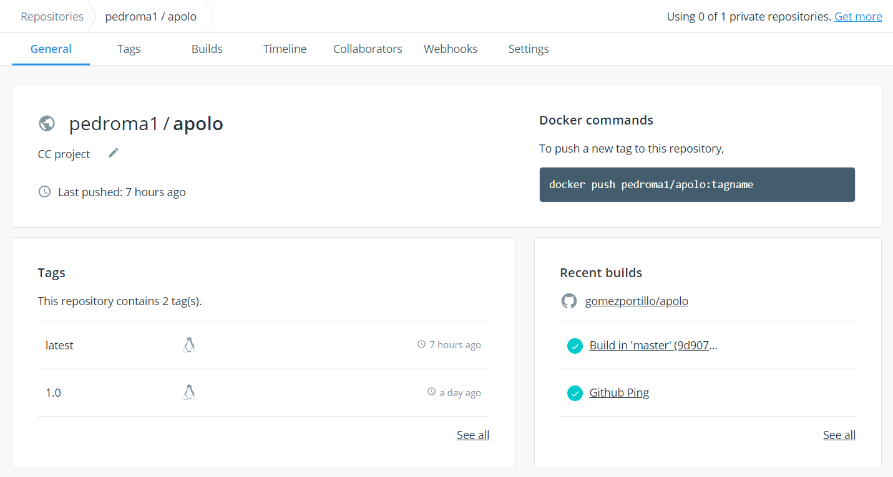

# Contenedores


El Proyecto Docker ofrece una plataforma completa de código abierto para construir, enviar y ejecutar cualquier aplicación, en cualquier lugar, utilizando contenedores. ([Referencia](https://hoplasoftware.com/por-que-elegir-docker-ee-frente-a-ce/))

A diferencia de las máquinas virtuales, un contenedor se ejecuta de forma nativa en Linux y comparte su kernel con otros contenedores. Además, no ocupa más memoria que cualquier otro ejecutable, lo que lo hace muy liviano.

[Referencia](https://docs.docker.com/get-started/)

Actualmente, Docker tiene dos versiones,

-   **CE**, o _Community Edition_, que incluye la funcionalidad de Docker orientada a personas. Es la que nosotros usaremos.
-   **EE**, o _Enterprise Edition_, que incluye una serie de características adicionales orientadas a compañías más grandes.

## Instalar Docker

Para instalar Docker en el entorno de desarrollo local se han seguido los pasos indicados en su [página oficial](https://docs.docker.com/install/linux/docker-ce/ubuntu/) y en el [tutorial](https://www.digitalocean.com/community/tutorials/how-to-install-and-use-docker-on-ubuntu-18-04) de DigitalOcean.

    sudo apt-get install apt-transport-https ca-certificates curl gnupg2 software-properties-common -y
    curl -fsSL https://download.docker.com/linux/ubuntu/gpg | sudo apt-key add -

    sudo add-apt-repository "deb [arch=amd64] https://download.docker.com/linux/ubuntu $(lsb_release -cs) stable"
    sudo apt-get update
    sudo apt-get install docker-ce

Para comprobar que Docker ha sido instalado correctamente y el daemon se ha inicializado podemos,

* Ejecutar `sudo systemctl status docker` para comprobar que el servicio está activo.
* Descargar y ejecutar un proyecto de prueba con `sudo docker run hello-world`. Docker, al no encontrar el proyecto localmente, se conectará a los repositorios oficiales, descargará la imagen, creará el contenedor y lo ejecutará, informándonos de que todo ha ido correctamente.

## Iniciar sesión

Para iniciar sesión en Docker, primero deberemos registrarnos en [DockerHub](https://hub.docker.com/). Esto lo haremos para poder subir la imagen creada a un repositorio más adelante.

Tras crear un usuario y una contraseña y enlazar el repositorio de GitHub, ejecutamos `docker login` e introducimos los datos para conectarnos a nuestra cuenta.

## Dockerfile

A continuación se presenta el Dockerfile del proyecto, y más abajo se pasa a explicar sus argumentos.

```Dockerfile
FROM python:3.6-alpine
MAINTAINER Pedro Manuel Gómez-Portillo López <gomezportillo@correo.ugr.es>

WORKDIR app/

COPY requirements-deploy.txt .
COPY apolo ./apolo

RUN pip install -r requirements-deploy.txt

EXPOSE 80

CMD ["python3", "apolo/server.py"]
```

* La instrucción `FROM` especifica la imagen base que utilizaremos para construir la imagen final. La idea de Docker es trabajar con imágenes lo más livianas posible, por lo que se ha dedicado un esfuerzo extra en esta parte para intentar conseguirlo. La primera imagen que se probó fue `ubuntu:latest`, que generó una imagen de **970MB**. No tenía sentido que el archivo final pesara ~1GB, así que tras buscar se descubrió que Alpine está especialmente optimizado para pesar poco, y más concretamente hay imágenes ya preparadas para determinados lenguajes. En este caso se ha usado `python:3.6-alpine`, consiguiendo una imagen de **80MB** (un 1200% más pequeña).

* La instrucción `MAINTAINER` indica el desarrollador de la imagen.

* La instrucción `WORKDIR` especifica el directorio de trabajo de las órdenes `RUN`, `CMD`, `ENTRYPOINT`, `COPY` y `ADD`y si no se especifica se creará automáticamente.

* La instrucción `COPY` copia archivos al directorio de trabajo para poder usarlos más adelante. En el Dockerfile se copian el archivo de dependencias y la carpeta entera con el código fuente, creando otra carpeta con el mismo nombre en del directorio de trabajo. El archivo con las dependencias del proyecto es una versión escrita específicamente para pesar lo menos posible; solo contiene las librerías que se usan en la fase de despliegue, no en la de desarrollo.

* La instrucción `RUN` permite ejecutar comandos en el directorio de trabajo; en este caso necesitamos ejecutar `pip` para instalar las dependencias antes mencionadas.

* La instrucción `EXPOSE` informa a Docker que el contenedor va a escuchar en ese puerto. Esto es importante, ya que a la hora de generar el contenedor necesitamos tener esto en cuenta.

* Por último, la orden `CMD` proporciona un comportamiento por defecto al contenedor. Sólo puede haber una en cada Dockerfile.

Ahora que ya tenemos el Dockerfile pasamos a generar su imagen. En este caso, tras situarnos en la raíz del proyecto, basta ejecutar

`
docker build --tag=pedroma1/apolo:1.0 .
`

para generar la imagen. El comando `--tag` nos permite indicar el nombre y la versión de la imagen. Ahora, con `docker image ls` podemos ver las imagenes que tenemos.

```bash
REPOSITORY          TAG                 IMAGE ID            CREATED             SIZE
pedroma1/apolo      1.0                 9f99751de59a        About an hour ago   87.9MB
python              3.6-alpine          1837080c5e87        3 weeks ago         74.4MB

```

El nombre de la imagen sigue el estándar `user/image:version`. Esto nos permitirá subirla a DockerHub más adelante.

Ahora, para ejecutar dicha imagen usaremos el comando `docker run -it -p 80:80 pedroma1/apolo:1.0`.

* `-t` indica a Docker que estamos usando una consola para que nos muestre información.
* `-i` mantiene abierta la salida stdin. Según [la página de Docker](https://docs.docker.com/engine/reference/run/) se debe usar junto a `-t` para ver la salida de la consola.
* `-p` bindea el puerto de la máquina local con el del contenedor. Así, cualquier mensaje entrante en el puerto 80 de la máquina es redirigido al puerto 80 del contenedor. Estos puertos no tienen por qué ser iguales.

Si quisiéramos ejecutar el contenedor sin salida en la terminal, bastaría ejecutar `docker run -d -p 80:80 pedroma1/apolo:1.0`. La opción `-d` indica a Docker que lo ejecute como daemon.

## Repositorio en DockerHub

Podemos subir el contenedor a DockerHub de dos manreas; en este caso se han utilizado ambas para comprobar que todo funcionaba correctamente.


### Push manual

Una vez hecho login localmente, basta con ejecutar `docker push pedroma1/apolo:1.0` para subir la imagen local al repositorio creado anteriormente, siempre que los nombres de usuario e imagen coincidan. Se creará una nueva tag o versión en el repositorio remoto que podremos descargar con `docker pull pedroma1/apolo:1.0`. El link al repositorio es https://hub.docker.com/r/pedroma1/apolo.

Todos los comandos, tanto para la creación de la imagen como para su subida a DockerHub, han sido incluidos en el [Makefile del proyecto](https://github.com/gomezportillo/apolo/blob/master/Makefile) para poder ser ejecutados cómodamente.

### Push automático

Para generar automáticamente el contenedor debemos añadir el repositorio de GitHub a DockerHub y seleccionamos que se construya automáticamente tras hacer push en GitHub. A continuación se adjunta un pantallazo en el que se ven los dos tags del proyecto; el primero (v1.0) fue subido  manualmente y el segundo (*latest*) se ha generado automáticamente desde el repositorio de GitHub.



## Despliegue

He visto que todos mis compañeros lo estaban desplegando en Azure, así que me ha parecido más interesante hacerlo en Heroku. Además, es extremadamente probable que en un futuro trabaje con Docker y no tenga cuenta en Azure, por lo que hacerlo en Heroku será una de mis primeras alternativas.

Lo primero que haremos será crear un proyecto nuevo en Heroku, al que llamaremos **apolo-docker**.

Tras descargar e iniciar sesión en el CLI de Heroku, hacemos login en el Registro de Contenedores con `heroku container:login`.

Ahora, tras situarnos en el directorio raíz del proyecto y ejecutar `heroku container:push web --app apolo-docker` volveremos a generar la imagen a partir del Dockerfile y la subiremos a Heroku.

Y por último, sólo queda ejecutar `heroku container:release web --app apolo-docker` para publicarla.


