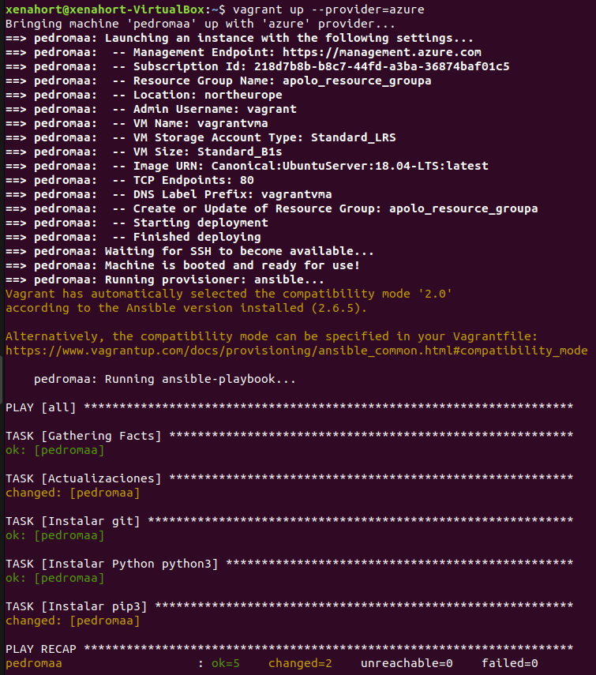
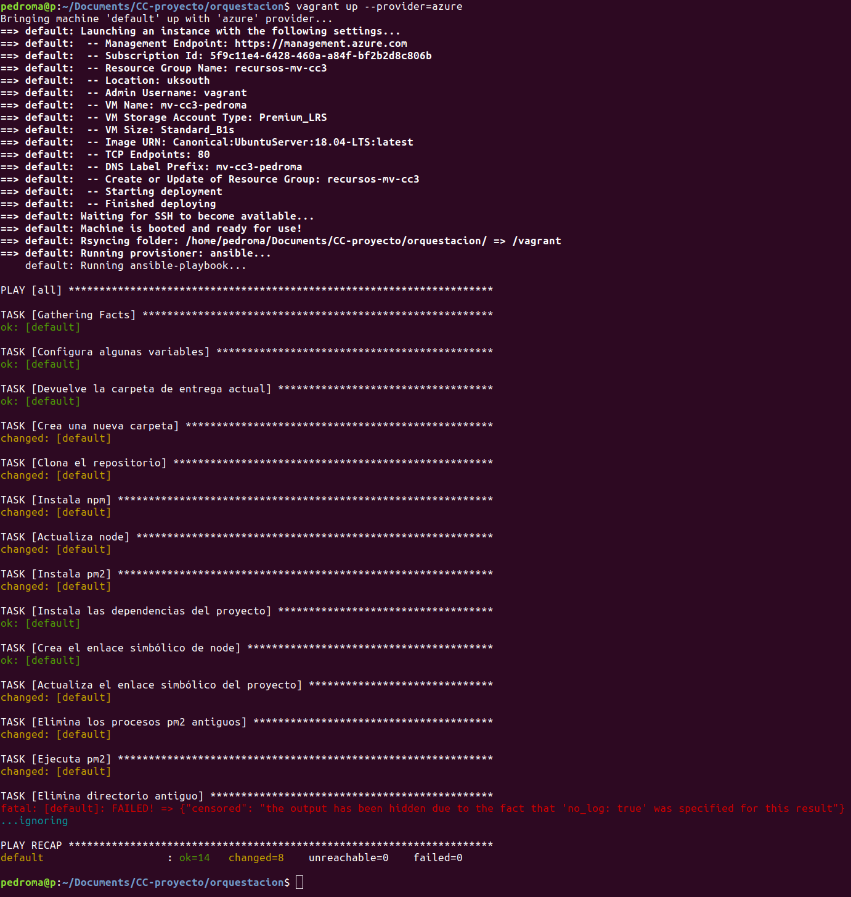

# Orquestación de máquinas virtuales con Vagrant

**Vagrant** es un sistema de orquestación de máquinas virtuales que permite usar diferentes tipos de provisionamiento para configurar estas máquinas, así como la conexión entre ellas.


## Tabla de contenidos

<!-- TOC depthFrom:1 depthTo:6 withLinks:1 updateOnSave:1 orderedList:0 -->

- [Orquestación de máquinas virtuales con Vagrant](#orquestacin-de-mquinas-virtuales-con-vagrant)
	- [Tabla de contenidos](#tabla-de-contenidos)
- [Instalación de Vagrant](#instalacin-de-vagrant)
	- [Integración con Azure](#integracin-con-azure)
	- [Integración con Ansible](#integracin-con-ansible)
- [Vagrantfile](#vagrantfile)
	- [Ejecución](#ejecucin)
	- [Salida por consola](#salida-por-consola)
- [Testing](#testing)
	- [Testeo de @xenahort de este proyecto](#testeo-de-xenahort-de-este-proyecto)
	- [Testeo del proyecto de @fpeiro](#testeo-del-proyecto-de-fpeiro)

<!-- /TOC -->

# Instalación de Vagrant

Para descargar Vagrant debemos irnos a su [página web](https://www.vagrantup.com/downloads.html). En este caso se está trabajando con Ubuntu, así que tras descargar el paquete `.deb`, basta situarse en el directorio de descargas y ejecutar

`sudo dpkg -i vagrant_X_x86_64.deb`,

donde `X` es la versión correspondiente, para instalar Vagrant. En este caso, se ha instalado la versión `2.2.2`.

Se puede comprobar su correcta instalación ejecutando `vagrant --version`.

## Integración con Azure

Lo primero que tenemos que hacer es comprobar que el CLI de Azure se encuentra instalado, para lo que basta ejecutar `az --version`.

Para poder usar Azure con Vagrant, primer necesitamos integrarlos. Para ello, primero es necesario generar un _Azure Active Directory_ (AAD) para dar permiso a Vagrant, y tras ello instalar el plugin de Azure para Vagrant.

En la [página oficial de GitHub de Azure](https://github.com/Azure/vagrant-azure) pueden verse los pasos seguidos para generar el _AAD_, que han sido los siguientes.

1. Instalar el CLI de Azure.
2. Hacer login ejecutando `az login`.
3. Ejecutar `az ad sp create-for-rbac` para crear un Active Directory de Azure con acceso a Azure Resource Manager lo que, tras unos segundos devolverá un resultado parecido al siguiente, de donde podremos obtener los datos que necesitaremos más adelante.


4. Por último, ejecutamos `az account list --query "[?isDefault].id" -o tsv` para obtener el ID de suscripción de Azure.

Ahora que ya tenemos todos los valores necesarios, y para no subirlos al repositorio, debemos exportarlos como variables de entorno para que el script de Vagrant pueda acceder a ellas. Para ello tenemos dos opciones; o bien ejecutar `export VARIABLE=value` para cada variable o hacer un _append_ en el archivo `/etc/environment` ([referencia](https://askubuntu.com/questions/58814/how-do-i-add-environment-variables)). En este caso se ha utilizado la segunda opción.

El nombre de las variables que necesitamos exportar dependen de cómo las queramos llamar en el script de Vagrant; en este caso se han denominado de la siguiente manera.

```bash
AZURE_TENANT_ID=$tenant
AZURE_CLIENT_ID=$appID
AZURE_CLIENT_SECRET=$password
AZURE_SUBSCRIPTION_ID=$subscription_id
```

Ahora que ya está todo configurado necesitamos hacer dos cosas; añadir la _caja_ de Azure a Vagrant y luego instalar su plugin, para lo que basta ejecutar los siguientes comandos.

```
vagrant box add azure https://github.com/azure/vagrant-azure/raw/v2.0/dummy.box --provider azure
vagrant plugin install vagrant-azure
```


## Integración con Ansible

Para poder provisionar con Ansible desde Vagrant basta con tenerlo instalado, para lo cual es necesario seguir los pasos indicados el en [hito 3](https://github.com/gomezportillo/apolo/tree/master/provision).

# Vagrantfile

El Vagrantfile completo puede verse [en el siguiente enlace](Vagrantfile).

Lo primero que se hice, tras crear las variables explicadas anteriormente, fue parametrizar el resto de variables de la máquina a crear del siguiente modo, donde

* La localización es la elegida en el hito anterior por medio de pruebas de velocidad.
* La imagen del sistema operativo es un Ubuntu 18.04 LTS, siguiendo con la elección justificada en los hitos anteriores.
* El tamaño y el tipo de disco duro son los más baratos ofrecidos por Azure.

```ruby
VM_LOCATION           = 'northeurope'
VM_NAME               = 'vagrantvm'
VM_RESOURCE_GROUP     = 'apolo_resource_group'
VM_NETWORK_SEC_GROUP  = 'apolo_network_security_group'
VM_IMAGE              = 'Canonical:UbuntuServer:18.04-LTS:latest'
VM_SIZE               = 'Standard_B1s'
STORAGE_ACCOUNT_TYPE  = 'Standard_LRS'
PLAYBOOK_NAME         = 'playbook.yml'
SSH_KEY_PATH          = '~/SSH_APOLO/key'
```

A la hora de definir el nombre de la máquina virtual es **necesario** que coincida a la expresión regular `^[a-z][a-z0-9-]{1,61}[a-z0-9]$`. Esto se puede comprobar de un modo simple, por ejemplo, con el sitio web [Rubular](http://rubular.com/). Se ha incluido [una imagen de su funcionamiento](img/rubular.png).

Una vez definidas las variables, el resto del Vagrantfile quedaría del siguiente modo

```ruby
Vagrant.configure('2') do |config|

	config.vm.define "pedroma" do |machine|

		machine.vm.box = 'azure'

		machine.ssh.private_key_path = SSH_KEY_PATH

		machine.vm.provider :azure do |azure, override|

			# Asignación de variables omitidas por claridad

		end

	end

	config.vm.provision "ansible" do |ansible|
		ansible.compatibility_mode = "2.0"
  	ansible.playbook = PLAYBOOK_NAME
	end

end
```

He partido del [readme del GitHub oficial de Azure](https://github.com/Azure/vagrant-azure) para generar el Vagrantfile, aunque tuve que adaptarlo a mis necesidades. Como necesitaba un nombre para poder acceder a las máquinas ya creadas desde Vagrant, como se muestra un poco más abajo, tuve que añadir la línea 2 del bloque de código anterior.

Las últimas líneas sirven para provisionar la máquina virtual por medio del playbook de Ansible lo que, aunque no es necesario para este hito, sí es conveniente ya que evita tener que hacerlo posteriormente de manera manual. La línea en la que se especifica la compatibilidad, aunque tampoco es necesaria, permite indicar manualmente la versión de Ansible que estamos utilizando para evitar que Vagrant tenga que adivinarla.

Por último, es necesario decir que para entender completamente la sintaxis del Vagrantfile tuve que buscar algunos tutoriales de Ruby.

## Ejecución

Una vez que ya está todo configurado podemos  situarnos en el directorio _orquestacion/_ para ejecutar Vagrant, aunque primero es necesario especificar el proveedor que estamos utilizando. Para esto, debemos ejecutar Vagrant de la siguiente manera,

`vagrant up --provider=azure`.

Ahora podemos acceder a las máquinas creadas ejecutando `vagrant ssh <name>`, provisionarlas ejecutando `vagrant provision <name>` o eliminarlas ejecutando `vagrant destroy <name>`.

## Salida por consola

Se adjunta una captura de pantalla del resultado de la ejecución de Vagrant.


# Testing

Este proyecto ha sido testeado por [@xenahort](https://github.com/xenahort) y yo he testeado el proyecto de [@fpeiro](https://github.com/xenahort). A continuación se presentan los pantallazos generados de dichas ejecuciones.

## Testeo de @xenahort de este proyecto



## Testeo del proyecto de @fpeiro


