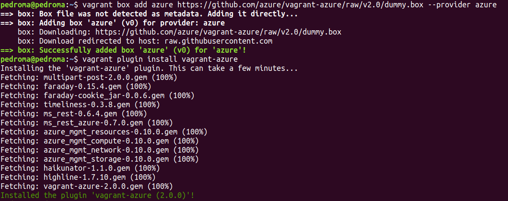

# Orquestación de máquinas virtuales con Vagrant

**Vagrant** es un sistema de orquestación de máquinas virtuales que permite usar diferentes tipos de provisionamiento para configurar estas máquinas, así como la conexión entre ellas.


## Tabla de contenidos

<!-- TOC depthFrom:1 depthTo:6 withLinks:1 updateOnSave:1 orderedList:0 -->

- [Orquestación de máquinas virtuales con Vagrant](#orquestacin-de-mquinas-virtuales-con-vagrant)
	- [Tabla de contenidos](#tabla-de-contenidos)
- [Instalación de Vagrant](#instalacin-de-vagrant)
	- [Integración con Azure](#integracin-con-azure)
	- [Integración con Ansible](#integracin-con-ansible)
- [Vagrantfile](#vagrantfile)
	- [Ejecución](#ejecucin)
	- [Salida por consola](#salida-por-consola)

<!-- /TOC -->

# Instalación de Vagrant

Para descargar Vagrant debemos irnos a su [página web](https://www.vagrantup.com/downloads.html). Tras descargar el paquete `.deb` correspondiente, basta situarse en el directorio de descargas y ejecutar

`sudo dpkg -i vagrant_X_x86_64.deb`,

donde `X` es la versión correspondiente, para instalar Vagrant. En este caso, se ha instalado la versión `2.2.2`.

Se puede comprobar su correcta instalación ejecutando `vagrant --version`-

## Integración con Azure

Lo primero que tenemos que hacer es comprobar que el CLI de Azure se ecuentra instalado, para lo que basta ejecutar `az --version`.

Para poder usar Azure con Vagrant, primer necesitamos integrarlos. Para ello, primero es necesario generar un _Azure Active Directory_ (AAD) para dar permiso a Vagrant, y tras ello instalar el plugin de Azure para Vagrant.

En la [página oficial de GitHub de Azure](https://github.com/Azure/vagrant-azure) pueden verse los pasos seguidos para generar el _AAD_, que han sido los siguientes.

1. Instalar el CLI de Azure.
2. Hacer login ejecutando `az login`.
3. Ejecutar `az ad sp create-for-rbac` para crear un Active Directory de Azure con acceso a Azure Resource Manager lo que, tras unos segundos devolverá un resultado parecido al siguiente, de donde podremos obtener los datos que necesitaremos más adelante.


4. Por último, ejecutamos `az account list --query "[?isDefault].id" -o tsv` para obtener el ID de suscripción de Azure.

Ahora que ya tenemos todos los valores necesarios, y para no subirlos al repositorio, debemos exportarlos como variables de entorno para que el script de Vagrant pueda acceder a ellas. Para ello tenemos dos opciones; o bien ejecutar `export VARIABLE=value` para cada variable o hacer un _append_ en el archivo `/etc/environment` [referencia](https://askubuntu.com/questions/58814/how-do-i-add-environment-variables). En este caso se ha utilizado la segunda opción.

El nombre de las variables que necesitamos exportar dependen de cómo las queramos llamar en el script de Vagrant; en este caso se han denominado de la siguiente manera.

```
AZURE_TENANT_ID=$tenant
AZURE_CLIENT_ID=$appID
AZURE_CLIENT_SECRET=$password
AZURE_SUBSCRIPTION_ID=$subscription_id
```

Ahora que ya está todo configurado necesitamos hacer dos cosas; añadir la _caja_ de Azure a Vagrant y luego instalar su plugin, para lo que basta ejecutar los siguientes comandos.

```
vagrant box add azure https://github.com/azure/vagrant-azure/raw/v2.0/dummy.box --provider azure
vagrant plugin install vagrant-azure
```



## Integración con Ansible

Para poder provisionar con Ansible desde Vagrant es necesario tenerlo instalado, para lo cual basta con seguir los pasos indicados el en [hito 3](https://github.com/gomezportillo/apolo/tree/master/provision).

# Vagrantfile

En sección se explican los parámetros utilizados a la hora de crear el vagrantfile.

A la hora de definir el nombre de la máquina virtual es **necesario** que coincida a la expresión regular `^[a-z][a-z0-9-]{1,61}[a-z0-9]$`. Esto se puede comprobar de un modo simple, por ejemplo, con el sitio web [Rubular](http://rubular.com/). Se ha includo [una imágene de su funcionamiento](img/rubular.png).

⚠️ TODO ⚠️

## Ejecución

Una vez que ya está todo configurado podemos ejecutar Vagrant, para lo que basta con ejecutar.

`vagrant up --provider=azure`.

Ahora podemos acceder a las máquinas creadas ejecutando `vagrant ssh <name>`, privisionarlas ejecutando `vagrant provision <name>` o destruirlas ejecutando `vagrant destroy <name>`.

## Salida por consola

Se adjunta una captura de pantalla del resultado de la ejecución de Vagrant.


