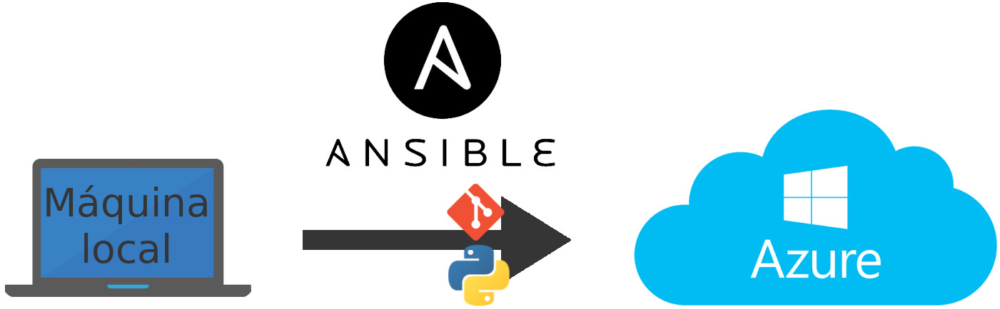

# Provisionamiento con Ansible

[Ansible](https://www.ansible.com/) es un sistema que permite el provisionamiento de máquinas remotas fácilmente. La imagen inferior muestra un cróquis de cómo funciona.



Para poder completar este hito se han seguido los siguientes pasos.

## Configuración de la máquina de Azure

Lo primero fue seleccioanr el sistema operativo que correría en la máquina de Azure. A la vista de los resultados del [siguiente artículo](https://www.premper.com/por-que-usamos-servidores-ubuntu), y siendo un sistema que ya conocía, elegí usar **Ubuntu Server 18.04 LTS**, o por su nombre en clave, **Bionic Beaver**. Es importante que sea una LTS ya que necesitamos soporto a largo plazo.

Una vez decidido el sistema operativo, se creó una máquina en Azure con los siguientes parámetros.

* **Nombre**: bionic
* **Region**: Europa
* **S.O**: Ubuntu Server 18.04 LTS
* **Nombre de usuario**: pedroma
* **IP**: Estática

Para el tipo de autentificación se eligio **SSH**, así que tras crear un par pública/privada de claves (`key.pub` y `key`, respectivamente) con el comando `ssh-keygen` y almacenarlas en la máquina local en `~/SSH_APOLO`, se indicó la clave pública en Azure a la hora de configurar la máquina.

Una vez configurada y creada podemos obtener su IP, que en este caso ha sido `40.80.144.11`. Ahora, acceder a ella en cualquier momento es tan facil como ejecutar en local,

```
ssh -i ~/SSH_APOLO/key pedroma@40.80.144.11
```

con el siguiente resutado.


## Provisionamiento de la máquina de Azure

Para instalar Ansible con pip basta ejecutar `pip3 install ansible` en local.

Para instalar automáticamente los programas necesarios en la máquina de Azure con Ansible se han escrito tres archivos, `ansible_hosts`, `ansible.cfg` y `playbook.yml`.

* `ansible_hosts` indica la dirección, el puerto y la clave privada que usaremos para acceder a las máquinas remotas. Si quisiéramos provisionar más máquinas bastaría con indicarlas en la sección `[azure]`, aunque todas deban compartir el mismo usuario y clave pública.

```
[azure]
bionic ansible_ssh_port=22 ansible_ssh_host=23.96.18.95

[azure:vars]
ansible_ssh_user=pedroma
ansible_ssh_private_key_file=~/SSH_APOLO/key
```

* `ansible.cfg` sirve para configurar Ansible indicándole dónde estará el fichero de hosts así como que no compruebe la clave del host.

```
[defaults]
host_key_checking = False
inventory = ./ansible_hosts
```

* Por último, en `playbook.yml` indicamos a Ansible los pasos que tiene que seguir, en este caso comprobar que git, python3 y pip3 existen (y si no crearlos), clonar el repositorio en `~/apolo` y ejecutar pip3 sobre el archivo `requirements.txt` que se encuentra en su raiz.

```yml
---
- hosts: all
  become: yes
  vars:
    project_path: ~/apolo
  tasks:
    - name: Updating repositories
      apt: update_cache=yes

    - name: Installing git
      apt: name=git state=present

    - name: Installing python3
      apt: name=python3 state=present

    - name: Installing pip3
      apt: name=python3-pip state=present

    - name: Cloning Apolo repository
      git:
        repo: https://github.com/gomezportillo/apolo
        dest: "{{ project_path }}"

    - name: Installing Python dependecies
      shell: "pip3 install -r {{ project_path }}/requirements.txt"
```

Tras situarnos en esta carpeta y ejecutar `ansible-playbook playbook.yml` en local el resultado de la consola es el siguiente.


Con ésto, la máquina de Azure quedaría provisionada.

## Despliegue de Apolo

Inicialmente se intentó incluir el despliegue de Apolo en la máquina de Azure con Ansible, pero cuando Ansible termina de ejecutarse borra todos los archivos que haya creado, incluyendo el reposotiro descargado. Esto se intentó evitar ejecutando `export ANSIBLE_KEEP_REMOTE_FILES=1` en la máquina remota como indicaban algunos hilos deforos como [Stackoverflow](https://stackoverflow.com/questions/30060164/save-temporary-ansible-shell-scripts-instead-of-deleting), pero sin resultado.

Los comandos para clonar el resositorio se dejaron en Ansible, ya que necesita el repositorio para poder  ejecutar pip3, pero finalmente se ha hecho el despliegue del proyecto en Azure de forma manual con la ejecución de los siguientes comandos en la máquina local.

```bash
ssh -i ~/SSH_APOLO/key pedroma@40.80.144.11
git clone https://github.com/gomezportillo/apolo
cd apolo
make&
exit
```

De este modo el proceso de Apolo quedaría ejecutándose indefinidamente. Para pararlo podríamos o bien reiniciar la máquina desde el portal de Azure o ejecutar lo siguiente en local,

```bash
ssh -i ~/SSH_APOLO/key pedroma@40.80.144.11
top | grep python3 #para obtener el PID del proceso
^C # para parar top
kill $(PID)
exit
```
